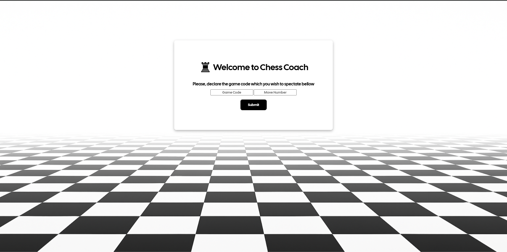

# 🔍 Chess Coach

This project, was born as the requirement of my friends and i, in order not don't behave like apes during the process of discussing plays and moves on specific chess scenarios.
As the result, i came up with the idea of building a paralel board that mirrors what is happening on specific moves on a game.
The codes are extracted from "chess.com" games URL's.

---

## 🚧 Beware!

This board is intended to be used for learning or interactive discussion, this board must not be used on live games, or it could be considered as cheating.
The irresponsible use of this tool, is not associated to me or any other person, but to the ones giving it a unethical use.
This tool is meant to be only for ethical use in non-competitive games for instructing porpouses only.

---

## ⚙️ Status

This application is still on development state, with not even a stable release, so please, keep in mind that most of the interactions and tools of this project, are still in progress.